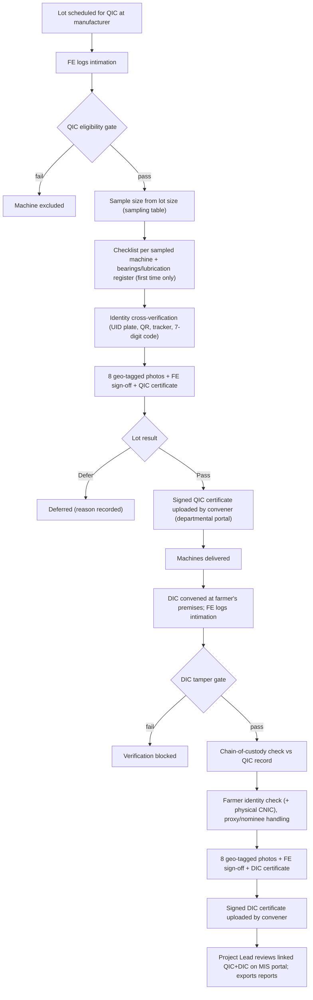

# End-to-End Workflow

## Steps

### QIC stage (manufacturer's premises)
1. A lot is scheduled for QIC; the FE receives official intimation and logs it in the app.
2. FE runs the **eligibility gate**; ineligible machines are excluded before inspection.
3. App computes **sample size** and permissible defectives from lot size (PSQCA scheme for Super Seeder).
4. FE completes the **49-parameter checklist** for each sampled machine, plus the manufacturer's one-time **bearings & lubrication register**.
5. FE cross-verifies farmer name, CNIC, machine ID and tracker IMEI against the UID plate print and decoded UID/tracker QR codes; mismatches flagged.
6. FE captures **8 geo-tagged photos**, signs off digitally; data uploads (or queues offline).
7. Once approved, machines become eligible for delivery.

### External events after QIC approval (departmental portal — not built here)
- Convener uploads the **signed QIC certificate** on the departmental portal.
- The **DIC convener is informed** how many machines, and to which farmers, the manufacturer will deliver.
- The **manufacturer can generate a bill** for release of the subsidy (government share).

### DIC stage (farmer's premises)
8. A DIC is convened at the farmer's premises; FE logs intimation.
9. FE runs the **tamper gate** (UID plate and punched code tamper-free; tracker present).
10. FE pulls the machine's **QIC record** and compares UID-plate signature photo and punched-code photo (chain of custody).
11. FE cross-verifies farmer identity (physical CNIC now available), handles **proxy/nominee** authorization (convener approves under signature).
12. FE captures the **DIC photo set** (8), signs off.

### External events after DIC approval
- Convener uploads the **signed DIC certificate**; the manufacturer becomes eligible to get the **CDR (farmer's share)** released by the Director General Agriculture.

### Reporting
13. Project Lead reviews QIC and DIC records as a linked pair on the MIS portal, resolves flagged discrepancies, and exports monthly reports.

## Transition period
Signed certificates and photo sets may also be shared via WhatsApp alongside system upload until manual channels are retired (duration: OQ-12).
